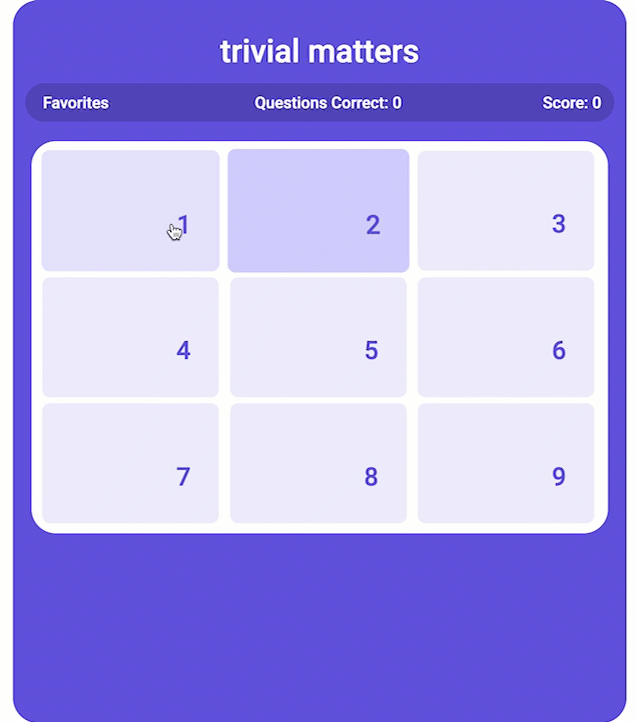
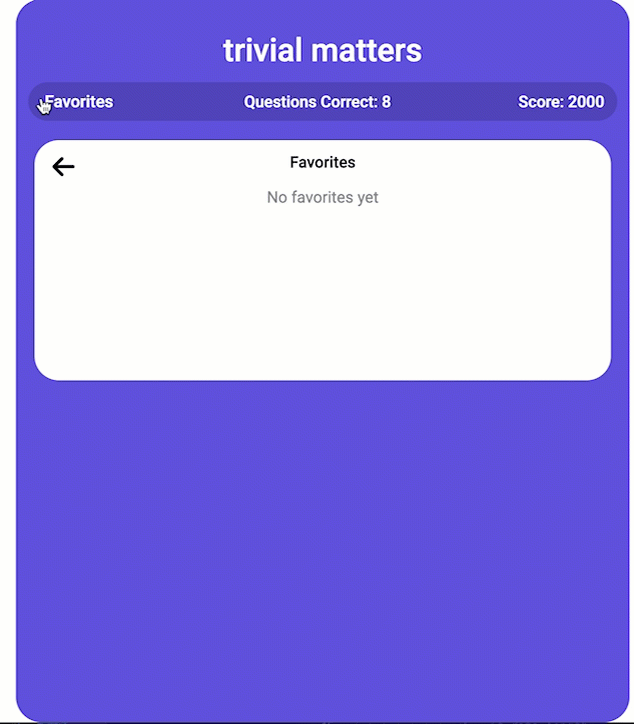

# Trivial Matters
A dynamic HTML, CSS, and JavaScript project for trivia enthusiasts who want to practice their trivia skills.

## Technologies Used

- JavaScript
- CSS3
- HTML5
- Trivia API [https://jservice.io/](https://jservice.io/)

## Live Demo

Try the application live at [https://rosemary-liu.github.io/trivial-matters/](https://rosemary-liu.github.io/trivial-matters/)

## Features

- Users can generate a list of question cards.
- User can click on a card to view and answer a question.
- User can view a list of cards of questions answered correctly.
- User can add a question to their favorites.
- User can remove a question from their favorites.
- User can view a list of cards of questions that were favorited.
- User can generate a new set of questions after all questions in current session have been answered.

## Preview




## Stretch Features

- Users can view clues grid organized by points in ascending value.

## Development

### Getting Started

1. Clone the repository.

    ```shell
    git clone https://github.com/rosemary-liu/trivial-matters.git
    cd trivial-matters
    ```
2. Install all dependencies with NPM.

    ```shell
    npm install
    ```
3. Open the project. Once opened, you can view the application by opening the `index.html` file in your browser.
